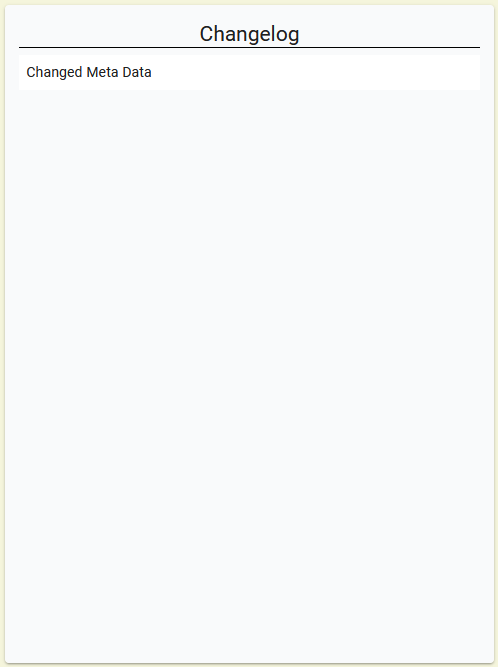

# RedactTogether

RedactTogether uses Slate as a base framework for editing and [Simple Docs](https://github.com/anshuman9999/simple-docs) 
as a foundation, as it is a viable and ready-to-use implementation of Slate.

When using "RedactTogether" it is suggested to use the latest version of Firefox, as with the other browsers
the performance may be decreased, due to the usage of Socket.IO.

## Prerequisites and Installation

To make "RedactTogether" run on your device do the following: 
Inside both the main folder (RedactTogether_Final) and the client folder execute:

### `npm install`

Once all the dependencies have been installed you can continue by doing the following inside the main folder:

### `node Server.js`

If successful, the console should show:

### `Server started at port: 8082`
### `Server running in DEVELOPMENT SERVER`
### `DB connection successful!`

Now the server is running and connected to the MongoDB.
ATTENTION: To access the database, you can also visit [MongoDB](https://www.mongodb.com/de-de) and use account:

User: RedactTogether

PW: Zpac.2021

This will be accessible, as long as the Github folder is set private.

Next, inside the client folder, execute:

### `npm start`

after that, the front end is set up.
As mentioned in the beginning, the most viable browser seemed to be [Firefox](https://www.mozilla.org/de/firefox/new/).
Ideally, you run one instance of RedactTogether on a normal Firefox tab, and a second one on a 
private tab. With that, two different users can be accessed simultaneously.

After on both ends a user registration has happened, you can login. ATTENTION, sometimes you have to refresh
the page after entering login credentials so that RedactTogether can then be used. 

A name for the transcript can be entered and then the document can be created by pressing add transcript.

After doing so, the document will appear in the lower section, seen here:

From there on, the desired document can be chosen by pressing "edit". In consequence, you will be redirected to 
the editing environment.

The centerpieces are the changelog:

which will store all the changes, and the toolbar:

 
which feature the different functionalities. As of now, only the suggestion mode (pencil icon) and the 
comment (comment icon) are working, the others being placeholders (jumping between changelog entries, play auditive files).

The assumed workflow is: 

1. Transcript owner goes to suggestion mode
2. Applies change to the transcript
3. Switches off suggestion mode
4. Participant clicks on the suggestion
5. Decides to accept or reject
6. If accepted, transcript owner adds a description and updates the changelog

With that, you can begin to work with your participants.

Happy member checking!

>Thanks to Lucas Pelloni for the template, taken from the SoPra 2020 class
